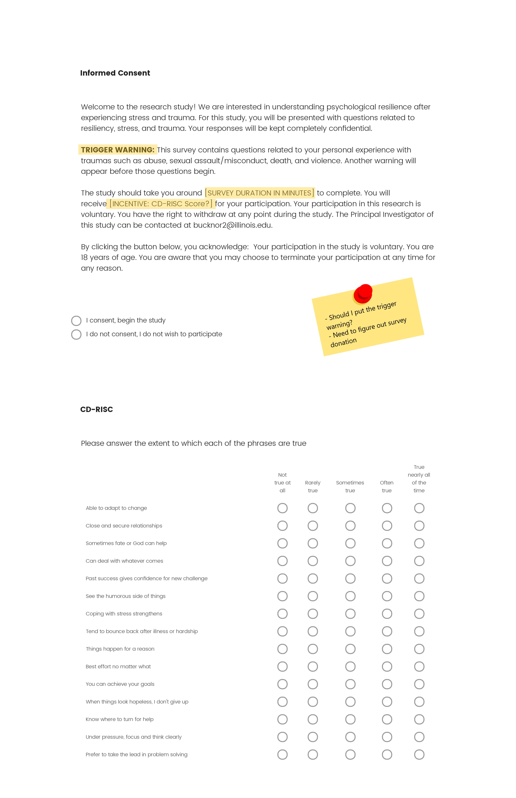
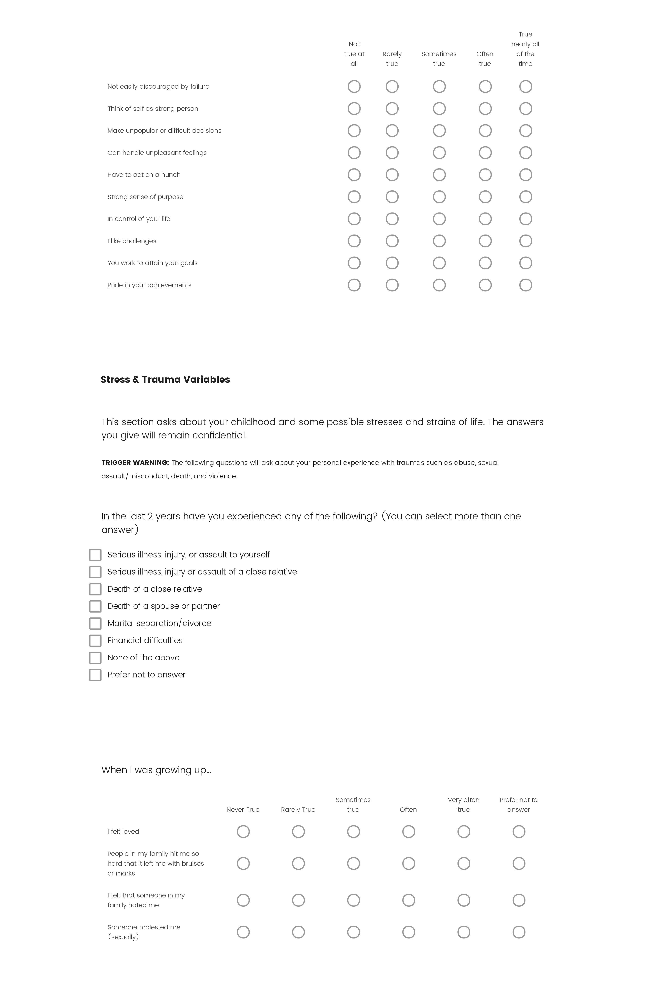
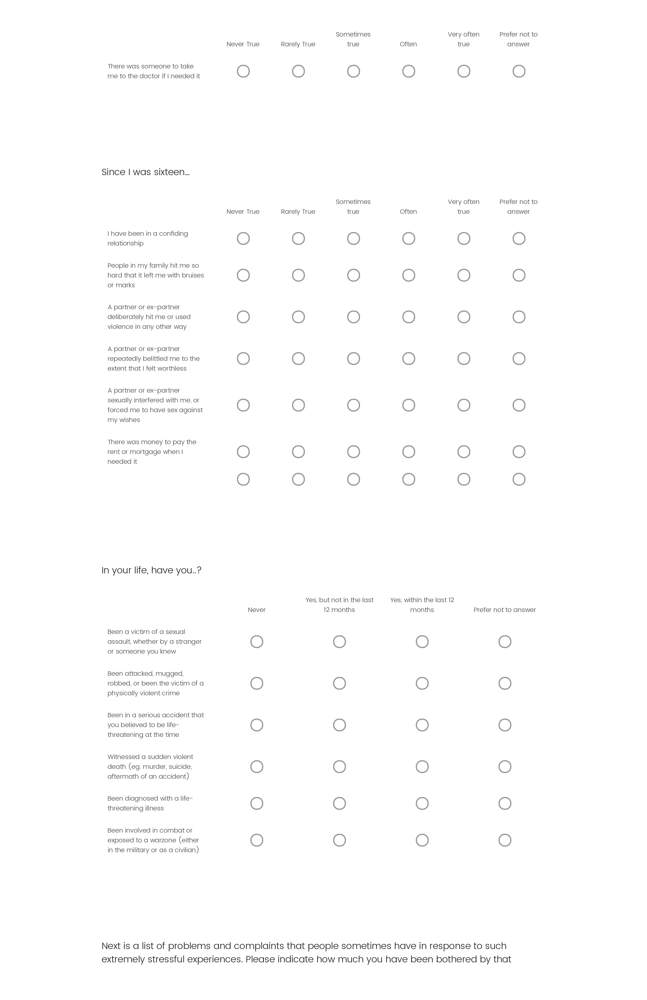
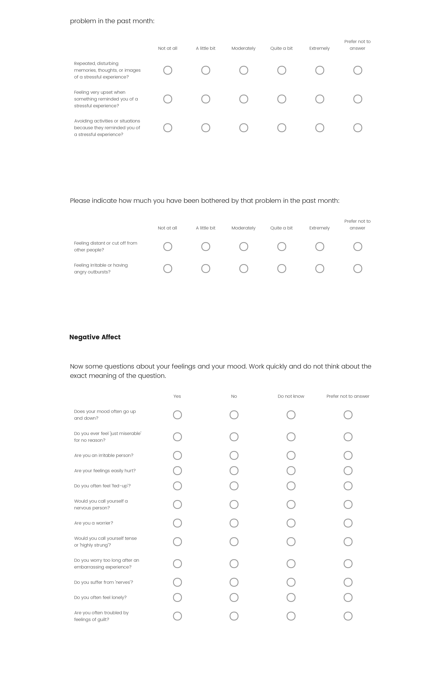
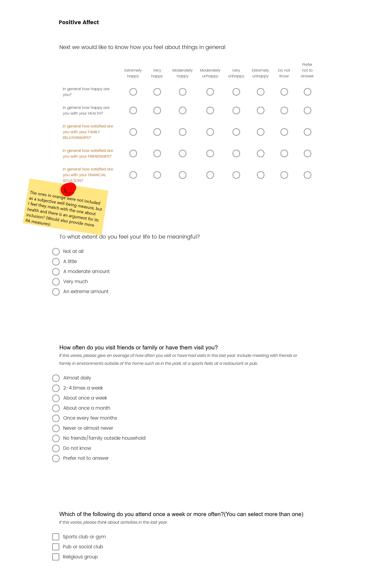
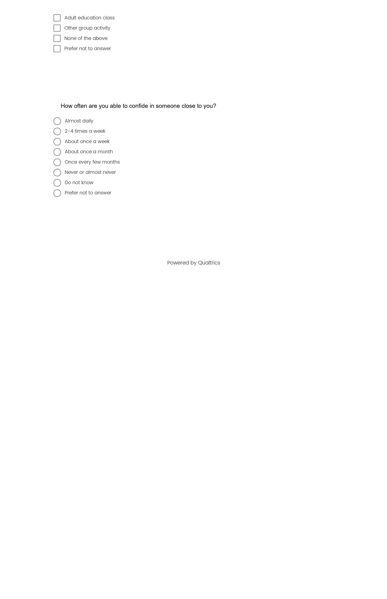

# Prelim Prep

##Task List:

&#9745; Request UKB data

&#9745; Put together rough draft of survey

&#9745; Request CD-RISC access

&#9745; Send committee member requests 

&#9744; Work on outline (Scrivener?)

&#9745; Set up new Git repo

&#9744; Bioinformatic/annotation decisions(Aim 3)

&nbsp;&nbsp;&nbsp;&nbsp;&nbsp;&nbsp;SNP+based enrichment analysis

&nbsp;&nbsp;&nbsp;&nbsp;&nbsp;&nbsp;GTEx

&nbsp;&nbsp;&nbsp;&nbsp;&nbsp;&nbsp;Genome Browser

&nbsp;&nbsp;&nbsp;&nbsp;&nbsp;&nbsp;SNPnexus

&nbsp;&nbsp;&nbsp;&nbsp;&nbsp;&nbsp;VarioWatch

&nbsp;&nbsp;&nbsp;&nbsp;&nbsp;&nbsp;[etc.](https://www.broadinstitute.org/genomics)


    


## Measuring Resilience

[Take the survey](https://illinoislas.qualtrics.com/jfe/form/SV_cN4hVyVIzujHq2V)

[PDF of survey](https://drive.google.com/file/d/1fE7nycQADg3ys3jfn5iH3oV1UooqauKw/view?usp=sharing)

```{r echo=FALSE,out.width= "250%", message=FALSE, warning=FALSE}

```
```{r echo=FALSE, message=FALSE, warning=FALSE}

```
```{r echo=FALSE, message=FALSE, warning=FALSE}

```
```{r echo=FALSE, message=FALSE, warning=FALSE}

```
```{r echo=FALSE, message=FALSE, warning=FALSE}

```
```{r echo=FALSE, message=FALSE, warning=FALSE}

```