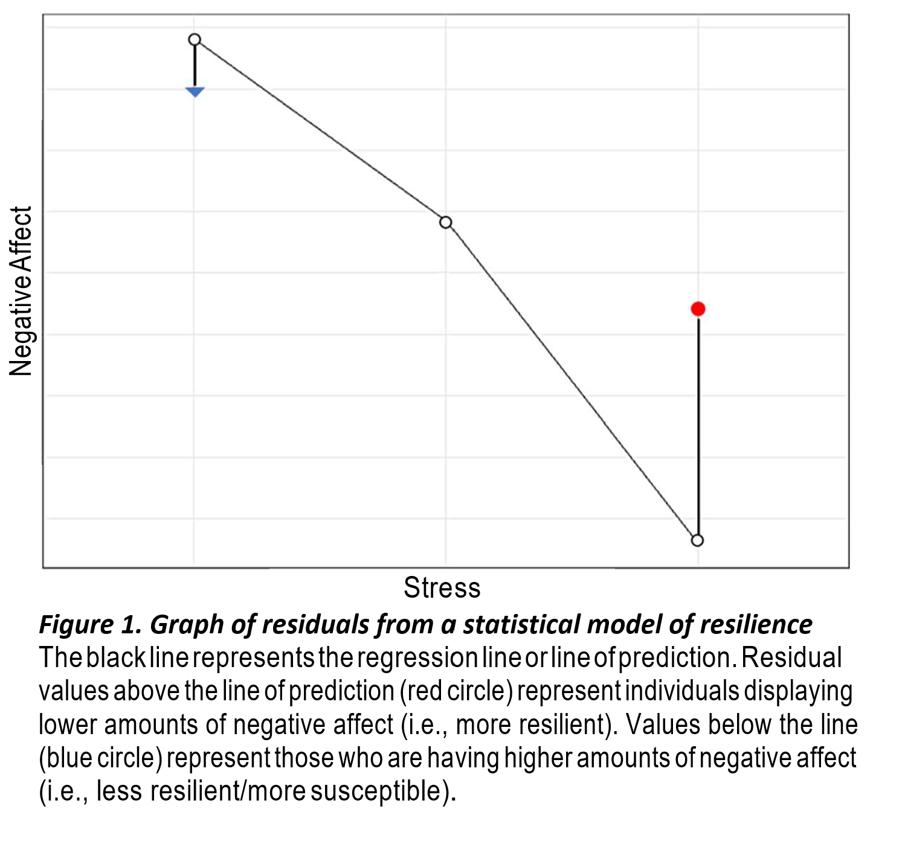

#Drafting

## Specific Aims {-}

Psychological resilience can be defined as one’s ability to successfully cope in the face of stress and trauma and either maintain a pre-stress level of psychological and physiological functioning or quickly return to it. Studies of resilience have identified it to be a multifaceted trait influenced by factors such as social support, socioeconomic status, successful termination of stress responses, and developmental timing of stress. Resilience has also been identified to be moderately heritable, evidencing a genetic component to the trait. While there is support for the influence of genetics in resilience, the genetic variants that contribute to the observed heritability are not well understood. In order to address this gap in knowledge, I propose a robust, large-scale genome-wide association study (GWAS) of resilience as well as follow-up analyses to investigate the polygenic nature of resilience further. In order to accomplish the proposed research, I will make use of secondary data available through UK Biobank. UK Biobank is a large population-based cohort that consists of survey data, which will allow for the construction of the resilience measure, as well as provide the genetic data needed to perform the GWAS. In addition, the identification of genetic variants will allow for further investigation of the extent to which their associated genes aggregate within influential pathways. Importantly, understanding the genetics of resilience can also contribute to the development of mechanism-focused interventions for those who are at increased risk for the development of psychopathology.

In order to accomplish the goals of this project, I propose three specific aims:

**Aim 1: Validate Scoring Algorithm to Convert Widely Available Psychological Assessments into Resiliency via Comparison with Established Measure Using a Large Online Sample**

As resilience is not directly measured in any existing large-scale genetic dataset, the first aim of the project is to validate my operational definition of resilience. Taking steps to validate the measure helps to ensure the GWAS will be as robust as possible, as measurement inaccuracies can result in unreliable results.

Resilience will be operationalized as negative affect residualized over stress and trauma. These measures will be obtained from survey data available through UK Biobank. In order to validate this construct of resilience, I will test it within a sample of the general population and assess how strongly it correlates with the Connor-Davidson Resilience Scale, the most commonly used measure of resilience. I hypothesize that they will be strongly correlated based on my recent exploratory study of polygenic proxies of resilience, which found this to be a robust operationalization of resilience.

**Aim 2: Perform a Genome-Wide Association Study of Resilience in the UK Biobank (N > 150,000)**

In order to identify genetic variants associated with resilience, I will perform a genome-wide association study (GWAS). To date, only one GWAS of resilience has been done but was limited by its sample size and generalizability. The proposed GWAS of resilience will improve on the one previously performed by leveraging a large sample size (N > 150,000) and a population-based cohort. The UK Biobank data will undergo seven specific quality control procedures before conducting the genome-wide association analyses. The results of the GWAS will identify which genetic variants (i.e., single nucleotide polymorphisms) are significantly associated with resilience at P < 5×10−8. These significant single nucleotide polymorphisms (SNPs) will then undergo further analyses in aim three, to better understand their relationship with resilience.

**Aim 3: Follow-up Analyses of GWAS Results to Investigate Biological Relevance and Polygenic Nature**

Following the GWAS of resilience, analyses will be performed to provide context and a greater understanding of the SNPs that were identified as being significantly associated with resilience. In this third aim, two follow-up analyses will be conducted. The first of which will be a SNP annotation, to provide genetic context for the SNPs. The second will be the construction of a polygenic risk score. In an independent replication sample, polygenic scores will be constructed by aggregating resilience associated SNPs to produce a single polygenic risk score of resilience. Once constructed, this score can then be used to predict individual resiliency.

Together, these aims will further our understanding of the genetics of resilience and move towards potential biological mechanisms that can be acted on to produce better mental health outcomes in those exposed to stress or trauma.

##Chapter 1: Introduction

Brief overview 

##Chapter 2: Background and Significance 

Stress is one of the strongest and most consistently identified risk factors for the development of psychopathology [1]. As most people will experience some form of stress or trauma within their lifetime [2], understanding the relationship between stress and poor mental health outcomes is paramount.
One approach that could help further our understanding of protective factors that defend against the development of psychopathology is through the study of psychological resilience. Psychological resilience is defined as the ability to maintain stable and healthy levels of psychological functioning after exposure to stress or other highly disruptive events [3]. While most people tend to be resilient, the reason why some individuals will develop psychopathology while others will maintain healthy levels of psychological function is not fully understood.

Resilience is thought to be influenced by a variety of factors, including the environment, cognitive-behavioral patterns, and genetics. While much research has focused on social and environmental factors that influence resilience, there has been a dearth of research into the genetics of resilience. Twin studies of resilience have identified it to be moderately heritable (31-52%) [4, 5], supporting genetic influences on the trait. However, to date, there are no replicable links to any genetic variant [6]. As a result, there is a significant gap in knowledge related to the genetic variants that account for the observed heritability [7, 8]. Closing this gap is not without challenges, though, as there are two roadblocks to progress: the need for a large-scale GWAS and consensus on the assessment of resilience [8].

###Defining Psychological Resilience

###Current understanding of the Genetics of Resilience

With advances in science and technology and increased access to large, publicly available data, many genetic studies have moved toward genome-wide association studies (GWAS) as well as polygenic scoring methods. However, when it comes to research into the genetics of resilience, few studies have used such approaches [8]. To date, there has only been one GWAS of resilience [9]. However, the study was limited by its use of a military cohort, which restricts the generalizability of the results. Another limitation of this study was its sample size (N = 11,492). When performing a GWAS, it is crucial to have a sample size greater than 100,000 as there is a high multiple testing burden that can only be surmounted by large sample sizes [10, 11]. In light of these limitations, future study is still needed to identify and understand the genetic variants contributing to the heritability observed in twin studies.

###Gap in knowledge/Dearth of research

###Proposal

##Chapter 3: Study 1 - Validation of Resilience Measure

###Challenges to Resilience Measurment

In comparison to other psychological traits, the study of resilience is relatively recent [13]. As a result, researchers still have not agreed on the best way to measure or even define psychological resilience [8]. Moreover, few large-scale datasets include a direct measure of resilience and those that do, do not have genetic data. As a result, resilience researchers are consistently put in the position of having to weigh measurement quality against statistical power. This balancing act and its associated consequences are reflected in the aforementioned GWAS of resilience. While the dataset used in that study did have direct measures of resilience, statistical power was constricted due to the modest sample size. If a large sample size is imperative to the study, as is the case for a GWAS, there are only two feasible options. One is to obtain a large sample of participants and directly measure resilience, which could be both costly and time-consuming. The second is to construct a measure of resilience from the variables that are available in these large-scale datasets. Out of these options, constructing a measure of resilience in a large dataset presents the most efficient path forward for a robust GWAS of resilience. This approach has advantages, as it not only allows for the preservation of a larger sample size but would also be both time- and cost-effective. An example of the construction of a measure of resilience when one is not available can be seen in my exploratory study of the genetics of resilience discussed earlier [12]. In that study, resilience was operationalized as negative affect residualized over stress and was found to be a valid operational definition of resilience [12]. The residuals identify deviations from the model's line of prediction and, therefore, can pick out individuals who were experiencing greater or lesser negative affect than the model predicted based on their level of stress.
This is visually represented in Figure 1, where positive residual values indicate lower amounts of negative affect than predicted, indicating greater resilience. Conversely, negative residual values would indicate higher levels of negative affect than predicted, indicating decreased resilience or greater susceptibility. This represents a well-developed construct of resilience, and if proper steps are taken to validate the construct, the quality of the measurement can be raised to a level similar to that of direct measures of resilience.

```{r echo=FALSE, message=FALSE, warning=FALSE}

```

###Importance of Measurement & Validation

### Approach for the proposed study

##Chapter 4: Study 2 - GWAS of Resilience

###Rationale for a GWAS of Resilience

With a GWAS of resilience, pathways for greater understanding of protective genetic factors that mediate stress adaptation would be opened and, with more study, could eventually lead to the development of prevention and early intervention measures for those at risk. For these benefits to be realized, though, it is imperative to have an accurate measure of resilience. 

###Approach for proposed study

##Chapter 5: Study 3 - Biological & Functional Annotation 

##Chapter 6: ????


